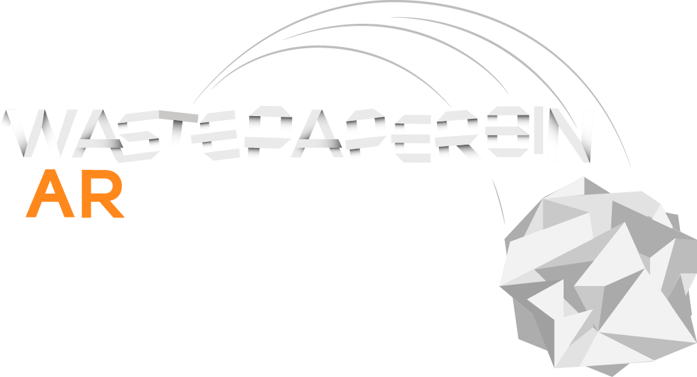

# Wastepaperbin AR

Small web based AR game to demonstrate the WebXR Device API AR implementation in
[Wonderland Engine](https://wonderlandengine.com/).

## Build instructions

To build and run the [Wonderland Engine](https://wonderlandengine.com) project,
download and start the latest version of the WebXR focused game engine
[here](https://wonderlandengine/downloads).

In case you do not have a license key, you can start a trial after signing up
[on the account page](https://wonderlandengine.com/account).

After you installed the engine and entered your license key:

1. Open "WastepaperbinAR.wlp"
2. Click the green arrow at the top (or hit F5).

Your browser will open with the web page.

### Running on Android

To view the game through Chrome on Android (which is currently the only browser
that supports WebXR AR):

1. Connect your phone via USB (make sure to have **developer mode enabled**)
2. Open `chrome://inspect#devices` on your desktop
3. Click "Port forwarding..." and forward `8080` to `localhost:8080`.
4. Open `localhost:8080` in Chrome on your Android device

## Game flow overview

The game renders nothing until the "AR" button is pressed.

### Scan Surroundings

As AR (and especially the AR hit testing) usually needs some time to
warm um, we help the tracking by letting the user scan his surroundings.
This provides more data to the SLAM to generate a 3D mesh of the area.

### Place Wastebin

Once we retrieve the first AR Hit Test result, the `hit-test-location`
component (shipped with Wonderland Engine's default components) marks itself
as `visible` and we can show the cursor mesh at that location.

Once we retrieve the first `select` event (e.g. a touch, or a trigger press
for AR headsets), we add a new object, attach mesh components, a trigger object
with `score-trigger` component and collider.

The game can begin!

### Swipe to Throw

The `paperball-spawner` is unhidden and now listens to `selectstart` and `selectend`
events to detect a swipe.

Once the user swiped for the first time, we hide the tutorial and instead show the
score.

### Resetting

The reset button appears after 3 throws to let the user jump back to the
"Place Wastebin" game state.

## JavaScript Components Overview

A short overview over the custom JavaScript components used in this project.
Find more detailed descriptions in the respective source files.

### ball-physics

Very rudimentary physics for the paper balls.

### confetti-particles

Confetti particle system based on meshes and objects with also
very rudimentary physics.

### paperball-spawner

Spawns paper balls on swipe.

### play-again-button

Resets the game state to "Place a Wastebin".

### roomba

Unused. Moves an object back and forth.

### score-display

Marks an object with text component as the overhead score display
for tutorials and score.

### score-trigger

Detects overlaps with balls to spawn confetti and increment score.

### wastebin-spawner

Spawns wastebins at hit-test locations.

## Acknoledgements

The wastebin, roomba and paper ball models were taken from
[Wastepaperbin VR](https://vhiterabbit.itch.io/wastepaper-bin) and were
created by [Maximilian Welscher](http://www.maximilianwelscher.com/).

The code was written by [Jonathan Hale](https://twitter.com/squareys).

## License

MIT (see [License.txt](License.txt)). You can use the project commercially
without having to open source your modified code.
